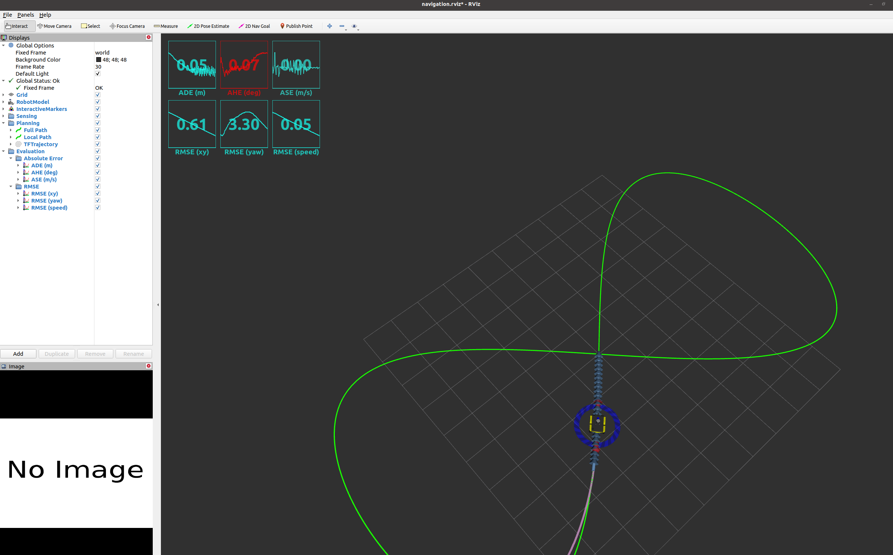
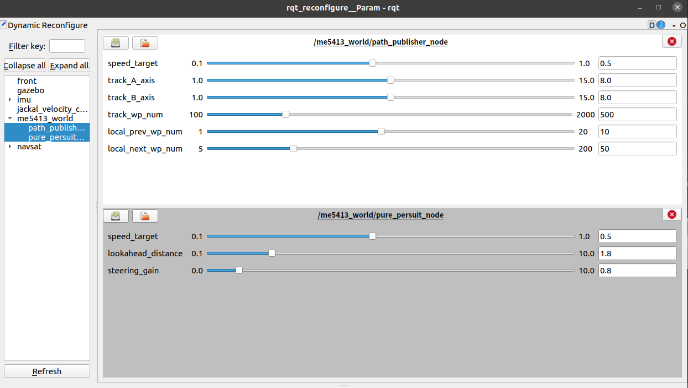

# ME5413_Planning_Project

NUS ME5413 Autonomous Mobile Robotics Planning Project.

In this project, we implement a <pure_persuit_node.py> (src/me5413_world/scripts/pure_persuit_node.py) to replace the original <path_tracker_node.cpp> to achieve path tracking of a figure '8'. 

Usage of this implementation is the same as the provided example.

> Authors: [Ziggy](https://github.com/ziggyhuang) and [Shuo](https://github.com/SS47816)
> 
> Modified by Group16: Tang Haodi, Wang Yiwen, Zhang Xinming


## Dependencies

* System Requirements:
  * Ubuntu 20.04 (18.04 not yet tested)
  * ROS Noetic (Melodic not yet tested)
  * C++11 and above
  * CMake: 3.0.2 and above
* This repo depends on the following standard ROS pkgs:
  * `roscpp`
  * `rospy`
  * `rviz`
  * `std_msgs`
  * `nav_msgs`
  * `geometry_msgs`
  * `visualization_msgs`
  * `tf2`
  * `tf2_ros`
  * `tf2_eigen`
  * `tf2_geometry_msgs`
  * `gazebo_ros`
  * `jsk_rviz_plugins`
  * `jackal_gazebo`
  * `jackal_navigation`
  * `velodyne_simulator`
  * `dynamic_reconfigure`

## Installation

This repo is a ros workspace, containing three rospkgs:

* `me5413_world` the main pkg containing the gazebo world, source code, and the launch files
* `jackal_description` contains the modified jackal robot model descriptions

**Note:** If you are working on this project, it is encouraged to fork this repository and work on your own fork!

After forking this repo to your own github:

```bash
# Clone your own fork of this repo (assuming home here `~/`)
cd
git clone https://github.com/<YOUR_GITHUB_USERNAME>/ME5413_Planning_Project.git
cd ME5413_Planning_Project

# Install all dependencies
rosdep install --from-paths src --ignore-src -r -y

# Build
catkin_make
# Source 
source devel/setup.bash
```

## Usage

### 0. Gazebo World

This command will launch the gazebo with the project world

```bash
# Launch Gazebo World together with our robot
roslaunch me5413_world world.launch
```

### 1. Path Tracking

In the second terminal, launch the path publisher node and the pure persuit node:

```bash
# Load a map and launch AMCL localizer
roslaunch me5413_world path_tracking.launch
```



### 2. Rqt_reconfigure

You can use the dynamic reconfigure GUI to tune the parameters used in pure persuit.




## Results

* The final tracking accuracy of pure persuit is shown in the figure above, metrics are reported below:
  * RMSE(xy): 0.61
  * RMSE(yaw): 3.3
  * RMSE(spped):0.05
  
* The parameters we tuned for pure persuit is shown in the above rqt GUI, those values are set as default values in <pure_persuit.cfg>:
  * speed_target: 0.5  (fixed)
  * lookahead_distance: 1.8
  * steering_gain: 0.8
  

## Contribution

You are welcome contributing to this repo by opening a pull-request

We are following:

* [Google C++ Style Guide](https://google.github.io/styleguide/cppguide.html),
* [C++ Core Guidelines](https://isocpp.github.io/CppCoreGuidelines/CppCoreGuidelines#main),
* [ROS C++ Style Guide](http://wiki.ros.org/CppStyleGuide)

## License

The [ME5413_Planning_Project](https://github.com/NUS-Advanced-Robotics-Centre/ME5413_Planning_Project) is released under the [MIT License](https://github.com/NUS-Advanced-Robotics-Centre/ME5413_Planning_Project/blob/main/LICENSE)
